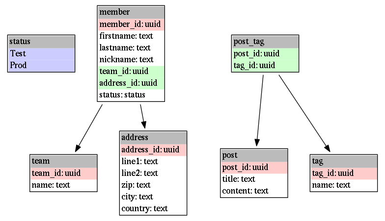

% Clean DB schemas
% Clément Delafargue
% 2014-10-14

-------------------------------------------

<span style="font-size: 5.5em;">λ</span>

-------------------------------------------

<div class="yolo" style="background-image: url(assets/schema.jpg)">
# SQL Database schemas
</div>

-------------------------------------------

<div class="yolo" style="background-image: url(assets/robot-door.gif)">
# Write your schema yourself
</div>

-------------------------------------------

<div class="yolo" style="background-image: url(assets/trap.gif)">
# DB-agnosticism
</div>

-------------------------------------------

<div class="yolo" style="background-image: url(assets/elephant-jump.gif)">
# Use postgreSQL
</div>

-------------------------------------------

<div class="yolo" style="background-image: url(assets/rube-goldberg.gif)">
# Avoid ORMs
</div>

-------------------------------------------

**But please use data mapping libraries**

Pomm (PHP), anorm / slick (scala), …


-------------------------------------------

<div class="yolo top" style="background-image: url(assets/academics.jpg)">
# Normal Forms
</div>

# Design with Querying in mind

# Primary Keys

-------------------------------------------

#Use UUIDs

(or random IDs)

-------------------------------------------

<div class="yolo" style="background-image: url(assets/hacking.gif)">
# Prevent entity enumeration
</div>
-------------------------------------------

<div class="yolo" style="background-image: url(assets/hacking.gif)">
# Prevent growth rate disclosure
</div>
-------------------------------------------

<div class="yolo" style="background-image: url(assets/table-flip.gif)">
# Avoid linking the wrong table
</div>

-------------------------------------------

<div class="yolo" style="background-image: url(assets/no-value.png)">
# Default to not null
</div>


-------------------------------------------

<div class="yolo" style="background-image: url(assets/elephants.gif)">
# Don't fear the join
</div>

-------------------------------------------

**Uniform naming for PKs & FKs**


    <table_name>_id

-------------------------------------------

**Uniform naming for PKs & FKs**

```sqlpostgresql
select <fields> from
  table_1
  inner join table_2
    on table_1.table_1_id =
       table_2.table_2_id
```

-------------------------------------------

**Uniform naming for PKs & FKs**

```sqlpostgresql
select <fields> from
  table_1
  inner join table_2
    using (table_1_id)
```
-------------------------------------------

**Uniform naming for PKs & FKs**

```sqlpostgresql
select <fields> from
  table_1
  natural join table_2
```

-------------------------------------------

**Use enums**

```sqlpostgresql
create type status
as enum('pending', 'validated');
```


-------------------------------------------

**Use rich types**

    inet (IP address)
    timestamp with time zone
    point (2D point)
    tstzrange (time range)
    interval (duration)

-------------------------------------------

**Create your own**

```sqlpostgresql
    create type my type
    as (
        field1 int,
        field2 text
    );
```

-------------------------------------------

**Use arrays**

```sqlpostgresql
    select '{1,2,3}'::int[]
```

-------------------------------------------

**Rich types => powerful constraints**

```sqlpostgresql
create table reservation(
    reservation_id uuid primary key,
    dates tstzrange not null,
    exclude using gist (dates with &&)
);
```
-------------------------------------------

<div class="yolo top" style="background-image: url(assets/shape-toy.gif)">
# You can dump K/V data
</div>


-------------------------------------------

<div class="yolo top" style="background-image: url(assets/shape-toy.gif)">
# You can dump JSON data
</div>


-------------------------------------------

**Common Table Expressions**

```sqlpostgresql
with sub_request as (
    select <fields> from table1
)

select <fields> from sub_request;
```

-------------------------------------------

# Shameless Plug


# jDbT

<https://github.com/divarvel/jdbt>

-------------------------------------------

**jDbT**

```yaml
status:
  - Test
  - Prod

member:
  name: text
  email: text
  status: status | 'Test'
  __unique: [ name, email ]
```

-------------------------------------------

**jDbT**

```yaml
post:
  member_id:
  +?title: text
  ?content: text

tag:
    +name: text
    __check: name <> 'forbidden'
```

-------------------------------------------

**jDbT**

```yaml
post_tag:
    post_id:
    tag_id:
    __pk: [ tag_id, post_id ]
```

-------------------------------------------

**jDbT**




# Thanks
